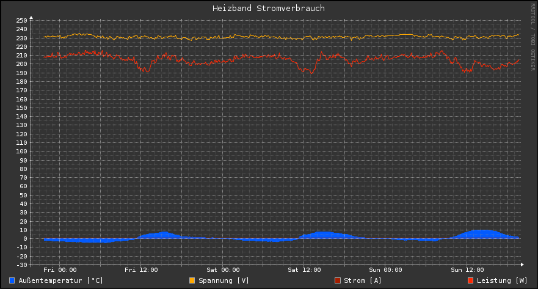

=====================================
Heat Tape Power Consumption Recording
=====================================

Python script to record the current power consumption of the installed heat tapes to
a RRD database and generate some graphs for visualization.

The current power consumption values (voltage, current and power) are requested using
the Modbus protocol from the WAGO 750-881 PLC.

Requirements
------------

* `python-rrdtool <https://github.com/commx/python-rrdtool>`_
* `pymodbus <https://github.com/bashwork/pymodbus>`_

Setup
-----

Add the following line to the **crontab** of the Raspberry Pi, so that the Python script
``htpc_update.py`` will be executed each minute and adds a new entry in the RRD database.

.. code-block:: shell-session

   * * * * * python /home/pi/htpc/htpc_update.py

This line can be added using the command ``crontab -e``.

The python script ``htpc_update.py`` requests the current values from the WAGO 750-881
PLC using the Modbus protocol and adds it to the RRD database.
Furthermore, it creates some graphs of the power consumption for visualization, e.g.:

The IP address of the WAGO PLC, the address of the Modbus register with the power values,
the path of the RRD database and the path where the graphs are created are defined in
``htpc_update.py``.
